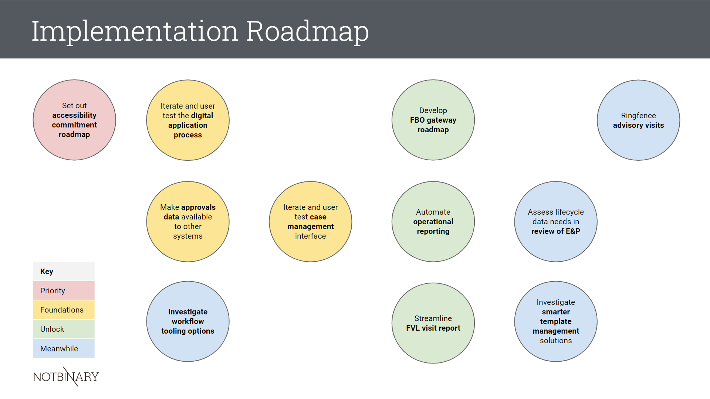

A “modern approvals service” is digital first. The [backlog recommendations](#recommendations) are presented on the basis that the FSA prioritises digital application and communication.  

Digital skills and confidence, especially amongst external users, is not high, so consideration must be given for [assisted digital support](https://www.gov.uk/service-manual/helping-people-to-use-your-service/designing-assisted-digital) options.

## Context 

**Goal:** enable consistent and accessible user experience and reliable and timely tracking of approvals applications. 

**Requirements:** 

*   improving the flow and integration of approval application data
*   facilitating better tracking of applications
*   reducing manual overheads for managing the service
*   meeting internal and external user needs through the application process

**Frustrating Themes:** 

*   Manual, Pressured = address through digital / data-driven application process (application form, FBO view, workflow-enabled)
*   Fragmented, Fractured, Isolated = address through digital case management (provides a single source of truth)
*   Misvalued = address through service recommendations priorities 
    * Measure for outcomes
    * Operate across silos
    * Enable Food Business Operators

**Premise:** improve data capture to support improved data flow

## Recommendations

- [Priority](#priority)
  - Set out accessibility commitment roadmap
- [Foundations](#foundations)
  - Iterate and user test the digital application process
  - Make approval applications data available to other systems
  - Iterate and user test case management
- [Unlock](#unlock)
  - Develop FBO gateway roadmap
  - Automate operational reporting 
  - Streamline FVL Report
- [Meanwhile](#meanwhile)
  - Investigate workflow tooling options  
  - Assess lifecycle data needs in review of E&P
  - Investigate smarter template management solutions
  - Ringfence advisory visits

## Notes

### Priority

* **Set out** **accessibility commitment roadmap** 
   * build on the existing accessibility work carried out by Digital
   * adopt and prepare [GDS-style accessibility statement](https://www.gov.uk/government/publications/sample-accessibility-statement)
  * ensure potential solution providers have clear, committed and timely accessibility roadmaps 
   * undertake and incorporate [assisted digital support](https://www.gov.uk/service-manual/helping-people-to-use-your-service) research 
   * ensure that content and language is reviewed for clarity, context and accessibility

### Foundations

* Iterate and user test the **digital application process** (not simply form) for new and extended approval applications, testing for 

    * Test for 
      * accessibility standards compliance (including ease of use for users who are not digitally confident)
      * contextually relevant guidance notes
      * question flow and branching
      * integration with other government services (including appetite for data sharing)
      * likely intervention points for value-added manual assistance
      * clarity of language and consistency with supporting literature and guidance
      * getting relevant application information at the right time in the right format to support digital processing
    * Revise legacy forms for digital process and data model.

* **Make approval applications data available to other systems**

    * Verify approvals data model against FSA data standards
    * Extend data standards to support approvals status modelling and reference lists
    * Isolate and construct [approvals application database](https://github.com/notbinary/fsa-approvals/wiki/Future-Technology-Recommendations#exposing-and-linking-to-fsa-data-via-apis)
    * Develop API to support approval application data flow and integration

* **Iterate and user test case management interface**, testing for 

    * accessibility standards compliance
    * relevance of key decision making information on caseload view
    * permissions and visibility across teams
    * extensibility for other lifecycle stages

### Unlock Benefits

* **Develop FBO gateway roadmap** 
   * Extend digital application form to secure FBO gateway / portal
     * Enable support for draft / saved applications
     * Expose relevant parts of case management view to support application progress tracking 
     * Enable notifications options
     * Support updating supporting documentation (by FBO) and sharing of reports (by FSA)
     * Extend for
   
        1. FBO self-serve administration 
        2. other in-life processes, such as audit, Statement of Resource, charges and invoicing 
   
* **Automate operational reporting** 

    * make data available to existing reporting tools, such as PowerBI
    * build and schedule relevant key performance reports
    * make available through reporting dashboard or by automated distribution

* **Streamline FVL visit report**

    * Migrate away from paper-based reporting to online digital reports 
    * Simplify and dynamically generate based on activities to be approved
    * Pre-populate with approval application data (such as establishment contact and address, approvals sought, FVL)
    * Consider using similar tooling as per audit

### Meanwhile

* **Investigate workflow tooling options** to serve as the separate engine behind applications

    * use the [scorecard](prototype-story-mapping) to assess functional suitability of existing tools
    * incorporate other investment decision factors (such as accessibility compliance, secure interoperability, cost of support and other IT Management Board requirements)
    * use the workflow design and data models to prototype relevant complex workflows
    * compare across tooling options (including PowerAutomate and K2 Workflow)
    * decouple from user interface to de-risk investment

* **Assess lifecycle data needs in review of E&P** 

    * core approvals applications data (including where establishments are pre-approval)
    * extended data support for [lifecycle stages](service-blueprint#service-lifecycle-stages-and-jobs-to-be-done), 
    * meta and reference  data support for status and triggers from other processes
    * support for approval application audit trail
    * functionality for data management support for retention policies and dealing with subject access requests

* Investigate smarter **template management** solutions

    * maintain a single and authoritative version-controlled content source 
    * integrate with snippets of official text (such as from legislation)
    * reusable for different processes (eg, approvals and audit)
    * reusable in different contexts (eg, web pages, controlled forms, formal correspondence)

* **Ringfence advisory visits** 
    * separate advisory visits from approval lifecycle to support more fluid processes and a less stop-start experience for both FBOs and the FSA
    * revisit business model around visits
    * distinguish FSA and other sources of expert guidance
    * define and publish “what we don’t tell you in an advisory visit”
    * research what an FBO wants to know about during the approval process 
    * define and publish checklist and FAQ, presenting in context as part of application process