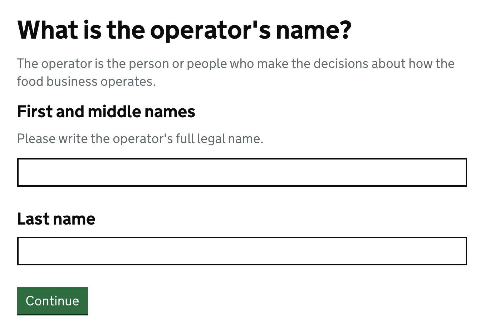
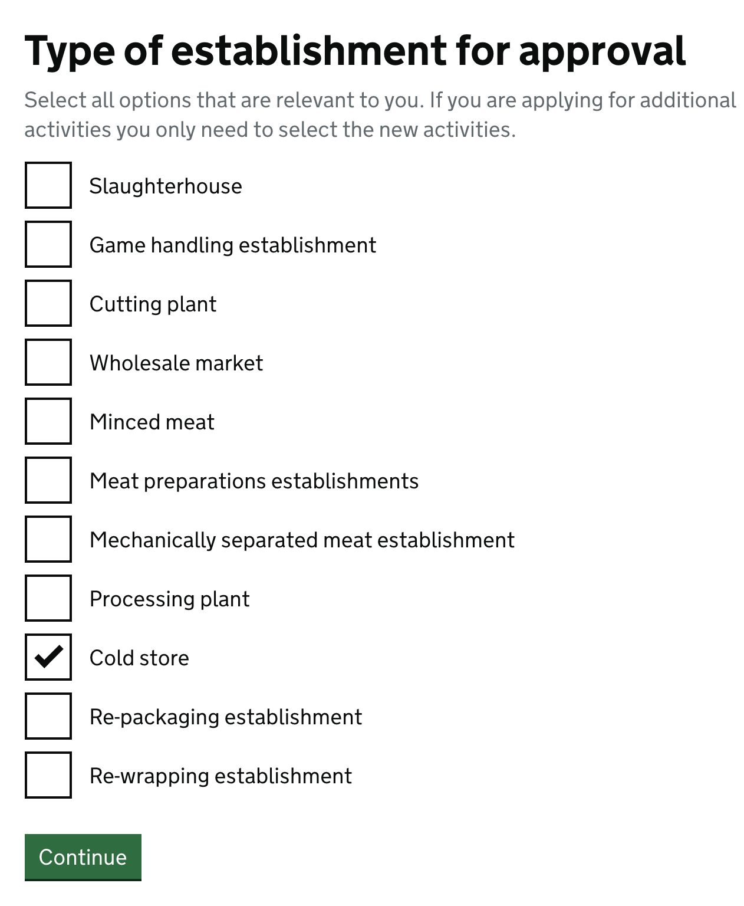
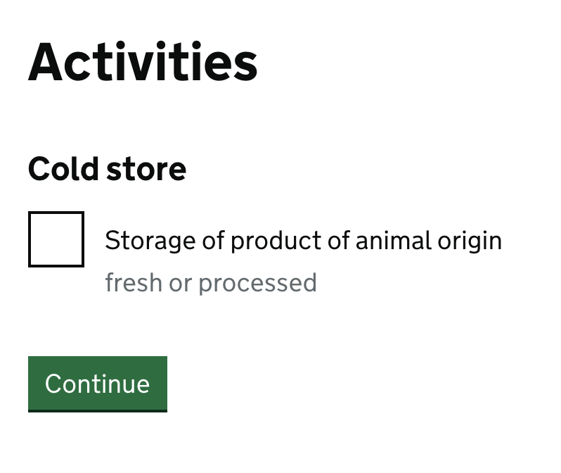
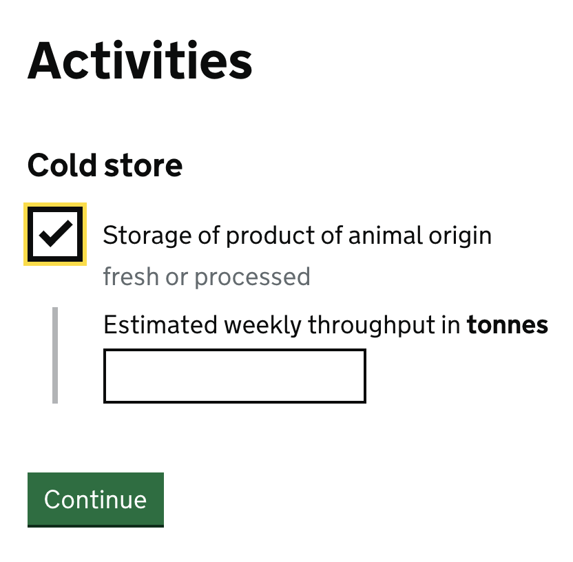
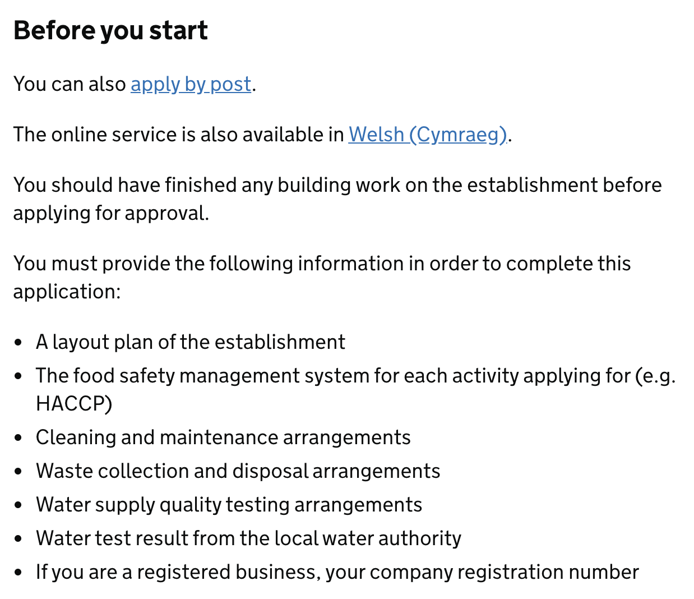
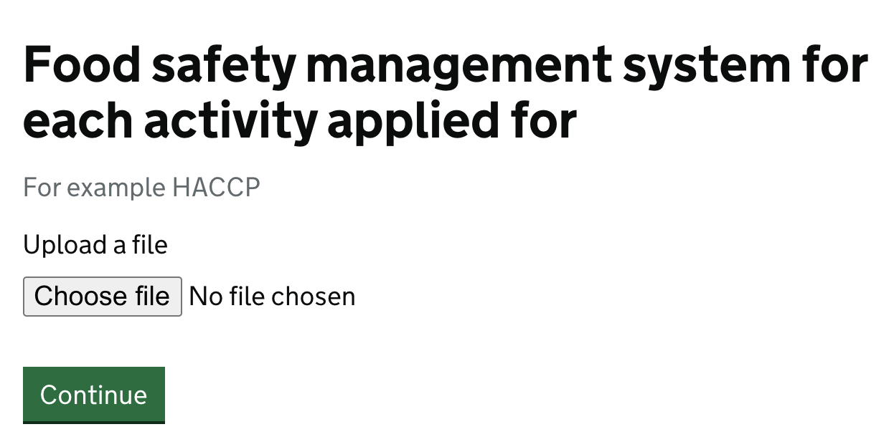

- [Prototype application form (prototype)](https://fsa-approvals-application-form.herokuapp.com/start)
  - Username: **fosshouse**
  - Password: **mallard**
- [Prototype application form (code on wiki)](https://github.com/notbinary/fsa-approvals/tree/master/Prototypes/approvals-application-form)
- [Application form user flow (Miro)](https://miro.com/app/board/o9J_kpUXKYg=/)
- [Application form user flow (PDF)](https://drive.google.com/file/d/1SrzdhG0TwD3gAu2ZOAH7tmxGZR7RYVeV/view?usp=sharing)
- [Application form walkthrough](https://docs.google.com/presentation/d/1cw2D73TyoVzXEIHy8MeSo0C9oRKcKF56NxCXL0CzXyk/edit?usp=sharing)

# Overview
The approvals application form forms the first interaction that the FBO has with the FSA. It is a paper document that the user prints out and completes and sends via post or email back to the FSA. This document may be accompanied by supporting documentation from the FBO. It is then reviewed by the relevant member of the approvals team (the assigned team member is based on the location of the establishment, that is, whichever area/cluster it sits in) and is manually entered into the Approvals log (Excel), APMS, and E&P systems. 

The approvals application form is currently completely paper-based. It is a Microsoft Word document that is downloaded, printed and sent by the FBO to the FSA. This is not ideal, as it requires that users have a word processor that supports this format. 

We identified early in the project that the approvals application form would be a candidate for prototyping. Many other Government services are going digital and the introduction of accessibility legislation means there is a need to provide suitable tools to allow for user completion. We identified that the [Government Digital Service (GDS) Prototyping Toolkit](https://govuk-prototype-kit.herokuapp.com/docs) would be ideal for testing our hypotheses. The GDS Prototyping Toolkit is a tried and tested set of tools designed for prototyping and made accessible. By leveraging this we were able to build a digital application form in a short amount of time.

The first step for this prototype was to move the form as-is to the digital format, this was completed in Week 2 and was a proof of concept to ensure that this approach would be viable. In the following weeks we reviewed the suitability of this straight transfer and found that the flow did not work with the digital format. We created a [new flow](https://miro.com/app/board/o9J_kpUXKYg=/), this grouped the relevant questions together and asked more business questions up-front. This allows for follow-up questions to be conditionally displayed to the user, rather than have them complete questions only to find them to be irrelevant to their application later. The form should be considered very much a prototype. There is more to do on it and it must be user tested before going to production.

## Walkthrough
[Application form walkthrough](https://docs.google.com/presentation/d/1cw2D73TyoVzXEIHy8MeSo0C9oRKcKF56NxCXL0CzXyk/edit?usp=sharing)

### Upon submission
Upon submitting the application a few back-office processes will be started:
    1. The data will be sent into the approvals log (current) / database (potential future option). This removes the need for the team to enter data into multiple places and removes the risk to the data integrity.
    2. A new approval entry is created and the timeline of events is automatically set-up in preparation - Review, conduct visit, write report etc. 
    3. The approvals team is automatically informed of the new application. Specifically, the approvals team member that is responsible for the area/cluster that the establishment sits under. We will know this from the postcode of the establishment in question and can automate this job. It is currently a manual process of the Approvals team.
    4. Any relevant teams/people with responsibility will be attached to the case - e.g. FVLs, finance team member, approvals team member etc (see the [Case Management System Prototype](prototype-case-management-system) for more details).
    5. Any background checks will be carried out - such as the SSRS report currently run manually by the Approvals team.

## Opportunities
The completion of the shift from paper to digital showed how a relatively small first step could transform the service for users. Moving on through the project we returned to the beginning with the form - how the flow could look. Given that we have a digital solution, we now have a lot more options available:
- We are able to conditionally show the user questions based on the answers they give
  - This has been incorporated into the prototype and is shown clearly in the [form flow document](https://miro.com/app/board/o9J_kpUXKYg=/)
- We can make the form device/software agnostic, rather than built for proprietary software (Microsoft Word).
- Accessibilty can be a first consideration.
- Data can be captured and entered into the relevant systems - removing the painpoint for the Approvals Team of multiple data entry. Paper based applications require the approvals team to manually check and enter data into various systems throughout the process - a digital solution can alleviate many of these issues by automating checks and moving data to the correct systems upon submission. 
- Currently manual tasks, such as validation and finance checks can be automated - Currently the team has to run a check using SQL Server Reporting Services (SSRS) to see if the applicant has had any establishments previously. This check could be automated and run upon submission of the application form.
- Version control - a single digital source means that users cannot use out of date paper forms and changes/fixes can be quickly incorporated.

## Design elements
### Accessibility and usability
The GDS Prototyping Toolkit is accessible as standard. This conforms to the new accessibility legislation and has been tested by the GDS, it was also put through a WAVE accessibility checker for this project and passed.

A pattern of the GDS Prototyping Toolkit is to ask one question at a time. This has been introduced in the prototype to make it easier for the user to complete the long and complicated form. 

### Case reference/application number
New - Upon submission the user is emailed and shown a case reference or application number. They can use this in a hypothetical portal system or if calling to enquire, organise visits or with any interactions about their application. The FBOs are not currently given any unique identifier when they complete an application. A case reference was something suggested by the FSA Data team - this could be used throughout the lifecycle of an FBO as a unique identifier and could be used to tie everything together (an approval number is the current solution to this).

### Intended start date
The paper form does not currently ask for this. When first presented to the Approvals team they did question why we would ask for this as it does not change the timeline. The reason to include this is to manage expectations, improve the reporting capability through more meta data and begin the relationship with new FBOs - a theme that we will see in the Case Management prototype too. We asked FBOs in our interviews if they would like to inform the FSA of this even if it made no difference and they said yes, it would be good to have this.

### Conditional questions
- Users will be given different paths through the form based on their answers, for example the type of business a user is running, the type of application the user wishes to complete, or the type of establishment and animals going through it will give different follow-on questions.
- This can be seen in the [form flow document](https://miro.com/app/board/o9J_kpUXKYg=/)

### SSRS checks - asking for full name
We heard in interviews with the team that this was a problem when running this check. If a user has not given their full first name or middle name the check may not find an existing record. We can address this by asking for full first and middle name and last name explicitly on the form. This will result in more reliable data.

### Conditionally revealing further questions
On the activities and throughput page the user will first be presented with a list of activities that relate to the establishment that they are seeking approval for. 

When they select an activity the throughput question will be displayed. This reduces the amount of inputs on the screen. 

In the first iteration of the prototype, the user was shown all the establishment types. Based on what they ticked the activities would then be shown, followed by the throughput inputs for the selected activities. This was updated to be two pages based on feedback and suggestions of the Approvals team

### Additional documents
Alongside the form, the FBO must submit additional documentation - HACCP, floor plans, geographical locations adn various other documents. We inform the user at the start of the process of the forms they will require in order to complete the application.

These currently can be recieved by the team via email or post (or in some cases faxed) after the application has been sent in. By allowing these to be submitted in a digital form we are providing ease of use for the team and FBOs, improved security and efficiency. These can be uploaded in the form on the relevant pages using the upload input:

## Results and feedback
The application form was put through the WAVE accessibility checker (after hearing that the Digital team use this tool). The results were very positive, only flagging issues that came from developer error due to the speed of development. The result is an accessible, digital form that could be taken to the next step in development.

Our research shows that the digital literacy of FBOs is varied from good to very poor. A digital form must address this, and the design patterns that are used by the GDS Prototyping Toolkit have taken this into consideration. Things like using plain and simple language in the questions and limiting the number questions shown at once to a user reduce the cognitive load - the mental effort required - for the user and therefore lead to a more usable form. Again, this has been tested by the GDS team and the toolkit is the result of a large team working with many users to provide a solid solution. It should be used as a starting point for any further development of a digital application form.

During a feedback session it was discovered that the SSRS check that is run can become unreliable if the applicant has not entered their full name. This was incorporated into the prototype to ask for full first and middle name and last name in separate input boxes.

During the latter stages we presented the data team with the form and asked for feedback. This was positively received however they would like to see form validation happening going forward.

## Further consideration and next steps
### Login area
A paper form allows FBOs to complete it in their own time, they are not constrained by timing out or exiting an online system. This could be addressed by introducing a login system to the application form (not prototyped).

### Automating data
An exisiting FBO that is wanting to make a change to their approval/establishment could have some of their data automatically populated on the form - for example contact and business information.

### Validation
We received feedback from the Data team about the lack of validation on the prototype. This is a key piece of functionality going forward and the form elements/questions should all make use of client-side and business logic validation.

### Contextual help
We heard from FBOs that the application form (particularly the HACCP) can be hard to complete. We also heard from the Approvals team that the supporting documents do not always come in the correct format. By having the form online, we can offer more help, be it links to the relevant sections of the Meat Industry Guide (MIG) or the Manual of Offical Controls (MoOC), a chat bot, help hints for inputs or a contact number on the page. This would help our users and improve the relationship they have with the FSA.

### Skipping irrelevant sections
If an exisiting FBO was requesting a change to their approval we could skip out some of the sections as we would not need them to complete the same information more than once when the FSA already holds it - for example, business information.