- [Prototype case management system (****Approvals team view****) (Clickable prototype)](https://xd.adobe.com/view/ff961b8e-4c4a-4424-955e-514140b2e5c0-aac5/)
- [Prototype case management system (****FVL view****) (Clickable prototype)](https://xd.adobe.com/view/08cd1d27-7333-4bdc-9b7f-9f4b9684b0b1-5d9e/)
- [Wireframe (Miro)](https://miro.com/app/board/o9J_ko1N5ok=/)
- [Wireframe (PDF)](https://drive.google.com/file/d/1kJc8otCif-YVLQvGlvu2taNTzPQDeTwG/view?usp=sharing)
- [Prototype system walkthrough](https://docs.google.com/presentation/d/1abtTl6nrRpIaoVVyteuMqVftp1CLeli0jyFCovo_zTU/edit?usp=sharing)

The prototype is also available as a single PDF and a zipped folder of individual images for each screen:
- [PDF version of the prototype approvals case management system](https://drive.google.com/file/d/1IkAulmP4-TD88xySs3Dcg-_KVgQw2X_i/view?usp=sharing)
- [Zipped folder of individual screens from the prototype system](https://drive.google.com/file/d/1y08aLUctJimNaOcQ0seQuEoulq_DWnmy/view?usp=sharing)

# Overview
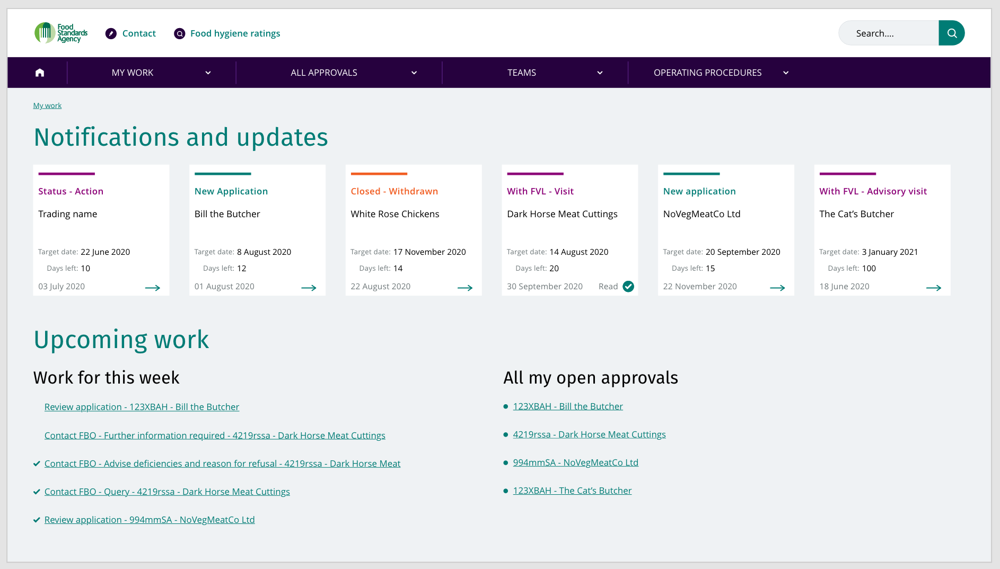

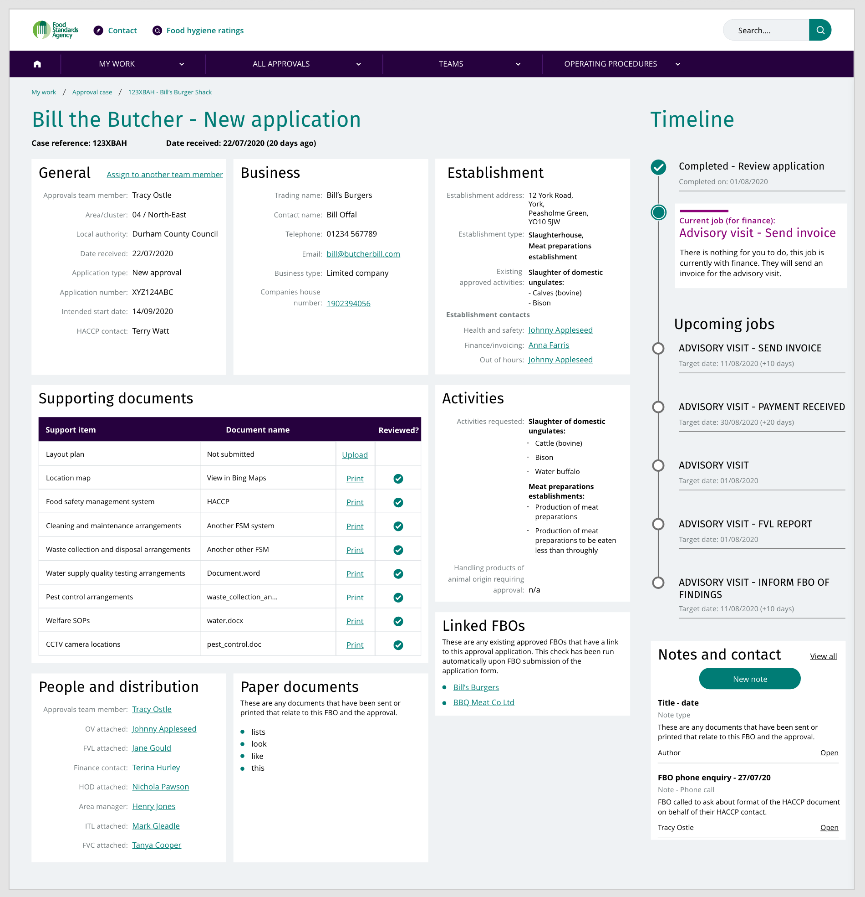

The case management system is a prototype system envisaged for use by the Approvals team throughout the life-cycle of an approval. It seeks to replace the multiple systems in use for approvals - the Approvals Log (Microsoft Excel spreadsheet), APMS, and Environments and People (E&P) (see [next steps](#further-consideration-and-next-steps) for information on how this could work). The system would have jobs going on in the background - pulling in the approvals application form submissions, storing files including supporting documents, photos, and PDFs for instance. Different teams within the FSA will have access to this system so they can make use of the same data and view and update the process of the approval. Once approved the FBO will remain within this system and be viewable for the time that they have an active approval with the FSA. Once withdrawn they would be retained within the system/database for the period of time required by the FSA.

Different teams will have different views available to them. An FVL could log into this system and view all the information, they would have different/removed options available to them (for instance they would not be able to hand over the case to another Approvals team member).

### Prototyping tools in use
There are two prototype systems. A wireframe (created in Miro) that gives a lower fidelity view of the system layout and aspects. After validating and gathering feedback from the Approvals team, the wireframe was used as a basis to design a [clickable prototype](https://xd.adobe.com/view/ff961b8e-4c4a-4424-955e-514140b2e5c0-aac5/). This was designed in Adobe XD. Adobe XD was selected as the tool to build this in due to the ability to easily share and gather feedback from the tool. You can click through and look at how the process will work from the overview screen through to a case and the details of this and actions available. The raw files for the Adobe files can be found on the [Google Drive](https://drive.google.com/drive/folders/1W-am_gxp8LxwRD78nY5O4-y9VrRHlKAK?usp=sharing) for this project

### Scenario
For this scenario we are logged into the system as a member of the Approvals team. We enter this prototype at the stage following the submission of an application by an FBO. The user will need to review the application and confirm this is all correct. They can send an email asking for outstanding documents and look at the FBO's Companies House data - a fetch of the data is illustrated.

## Walkthrough
If at any point you are unsure of where to go next you can click anywhere on the screen and a blue highlight will be shown, indicating where to click to progress. You can also use the arrow left and right keys to move through (like you would a slideshow presentation).

[Prototype system walkthrough](https://docs.google.com/presentation/d/1abtTl6nrRpIaoVVyteuMqVftp1CLeli0jyFCovo_zTU/edit?usp=sharing)

## Opportunities
This prototype seeks to address the issues discovered during user research and the project outline. Having put the prototype infront on the Approvals Team, they believe that the issue of multiple system entry of data will be solved by this. This prototype works on the idea that all the data involved with an approval is coming in and out of one system. This system will be the front-end of any multiple systems currently in place, joining up many currently siloed systems. With the view of eventually replacing these disparate and individual systems.

There are jobs happening in the background to the prototype that are currently manually carried out - checks are currently manually run such as:
- financial audit checks
- viewing application information against Companies House
- updating the approvals log. 
- Checking the postcode for area/cluster
  - followed by assigning relevant team members

This prototype seeks to automate these processes in order to allow the Approvals Team more time to work in a customer relationship role rather than a data entry role.

The teams within the FSA are working in isolation with their tools/systems. This prototype shows what the approvals system could look like, however there is potential for it to be expanded to meet the needs of other teams such as Finance and Inspections. The [card element](#Cards) allows components to be swapped in where needed for different teams and different stages, providing the ability to use a single system throughout the lifespan of an FBO. The elements generally have been designed with reusability and scaleability in mind.

## Design elements

### The grid
The prototype has been created using a 12 column grid system. This grid allows for flexibility for different elements of the design. It is suitable for the modular approach that has been taken here.

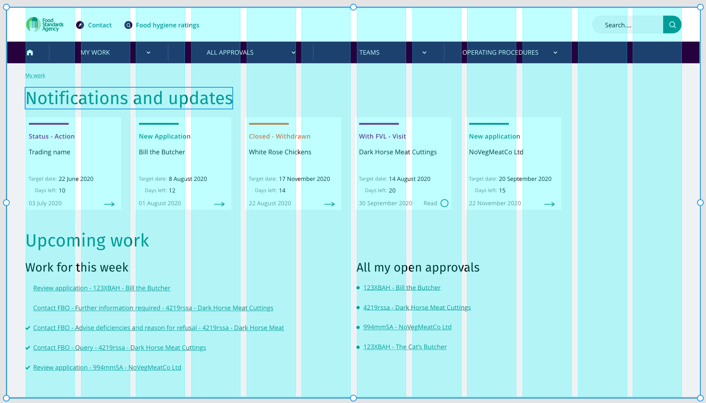

### FSA Pattern Library
The colours and typefaces have been taken directly from the [FSA pattern library](https://pl.food.gov.uk). Other elements have taken inspiration from exisiting elements in the pattern library. have been designed with similar elements from the pattern library:
- **Notifications** - Notifications for the user take a cue from the [Latest news](https://pl.food.gov.uk/#latestNews) element in the FSA pattern library. They are used on the overview page to alert the user of updates to any cases they are attached to. If another team member completes an action, they will be informed of this.
  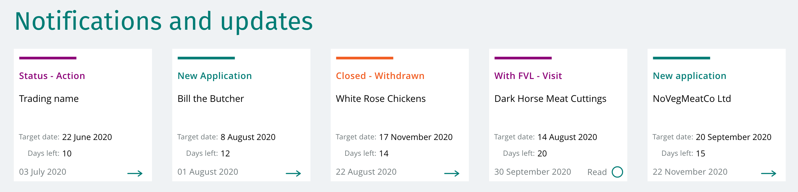

- **Checklists** - The overview screen uses the design component for checklists from the pattern library. Once completed a job will show a tick beside it.
    

### Cards
Cards are used in the prototype as a method of displaying pieces of related information to the user. They can be scaled up to become wider if necessary. They can be swapped in and out where necessary. They should be used to convey grouped information for a given heading, rather than information that is not related or relevant to each other. Cards have the additional benefit that they can be easily reconfigured for different screen sizes. Whether that is a wide screen desktop vs a smaller laptop, a tablet or a mobile device. Cards can be stacked, the column width and how many cards can fit in these can be automatically scaled and the ordering can be maintained. This can work well when building this as an accessible website. The user can use the keyboard tab button to quickly move through the headings of the cards, clicking into the card they need in order to find out more (this would need to be tested in order to validate).

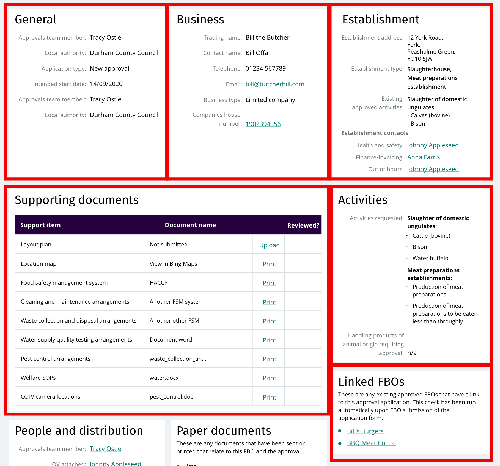
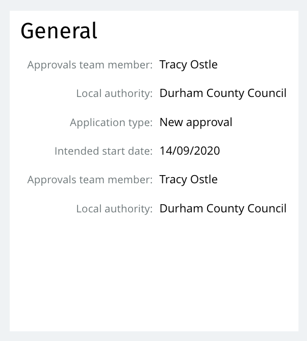

Cards can also be seen in the review process - each heading from the form is contained within a card that the user will sequentially review.

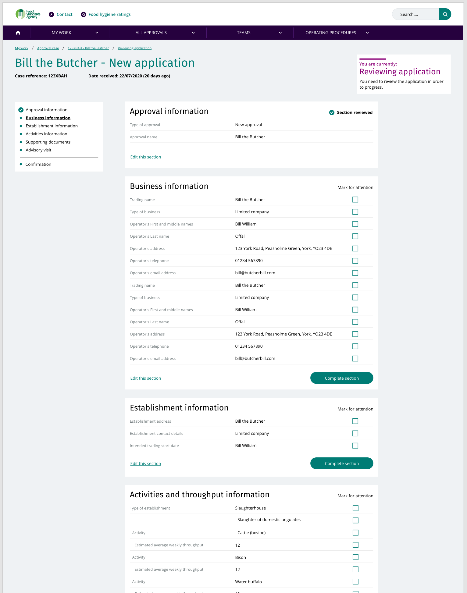

### Timeline
The timeline is an important new feature of the case view screen. It provides at-a-glance information about the current stage, completed work and upcoming work relating to this approval. It is useful as if an FBO wants to know where their application is, the approvals team can quickly answer this question along with what is coming up.

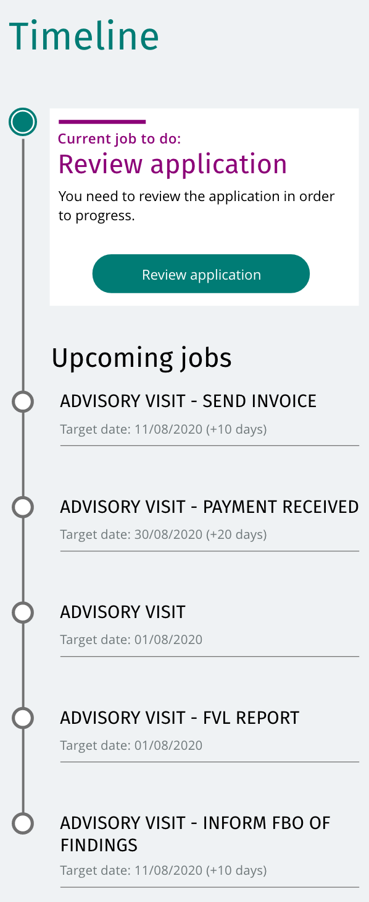

The jobs to do will be created upon submission automatically in the back-end of the system. In this example we see up to the approval FBO feedback report as we do not know what they will do after this - continue with the approval or withdraw.

The current job is highlighted to the user in the form of a small card. A call-to-action will be attached to this if the user has to complete a task. If the user does not have a job to do - because the job is with another team member - they will see what the job is and who it is currently with.

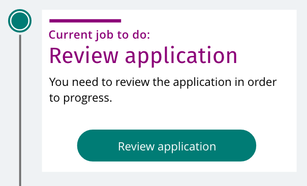

Completed jobs will appear above the current stage:

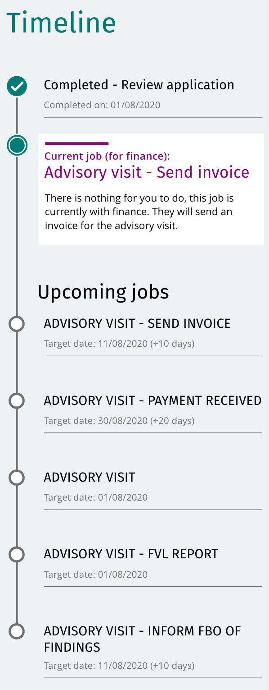

### Drawer view
Where there is a small amount of interaction required we do not send the user to a separate page (such as when reviewing an application). We will show the user the interaction through the sliding drawer view. A judgement approach should be used when approaching the type of data/interactions to be put into a drawer view. An email is a good example of an approriate usage for this device. The user has a relatively simple task to perform with limited options. Likewise, assigning a case to another user.
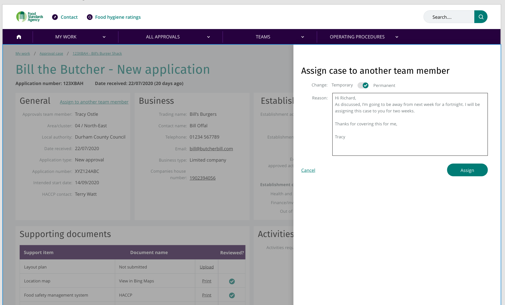
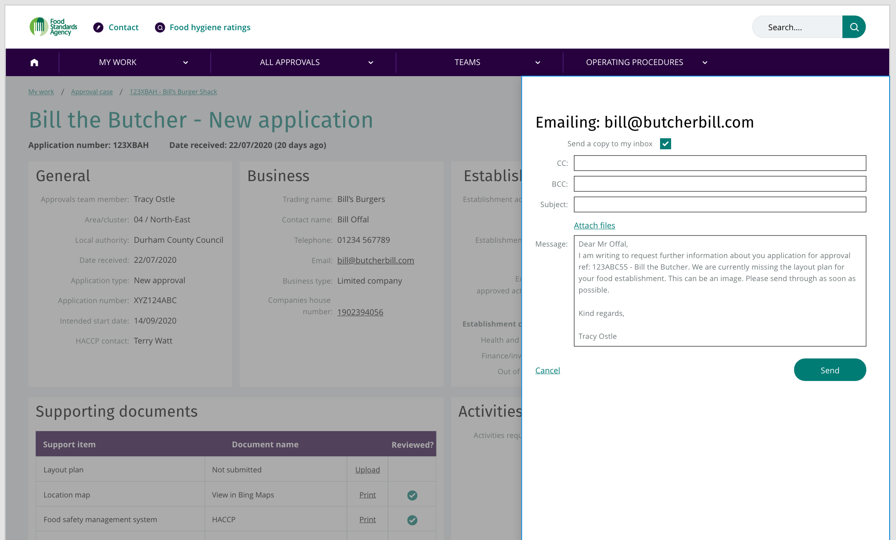

**Care will need to be taken to ensure this is accessible and user acceptance testing would need to be completed to ensure it is usable.*

## Results and feedback
When presented to the Approvals team the design was met with positive response. 

We received feedback from the Approvals team that was incorporated:
- The ability to handover a case to another team member
- Postcode checking of an establishment

During the final week of the project we recieved further feedback that could not be addressed in this prototype:
- **Audit history of the FBO** - there is an example of looking at related establishments in the prototype. This would also need to include the audit history.
- **Establishment notes** - General FBO notes can be added in the system, however notes specific to the establishment could be useful within the Establishment card. This would make it easier for FVLs to get to the relevant notes quickly. Alternatively, there could be an Establishment note type that a note in the existing notes card could have applied to it.
- **"What3Words" incorporation** - The address of an establishment does not always reflect the actual location. The Approvals team uses a tool called "What 3 Words" to pinpoint within 3 metres the actual location of the establishment.
- **Companies House charges detail** - This is not necessary for the Approvals team and could be removed for them. This would need to be tested/confirmed with the Finance team as they may still need this information.

### Accessibility
This clickable prototype highlights some of the possible functionality available. Some of the elements (namely those taken from the FSA pattern library) will be accessible already, however further testing with users and the relevant accessibility testing tools will need to be applied. As mentioned earlier, the design affords itself to a responsive nature, that is one that will work across devices and screen sizes. It seeks to solve the accessibility issue of E&P only working with Internet Explorer. The modular card design could be made accessible in a straight forward way. The tray design element should be approached with a similar approach to making navigation menus accessible, as it is using similar principles.

## Further consideration and next steps
This clickable prototype highlights some of the possible functionality available. The design has been considered as a replacement for the approvals log Excel spreadsheet first and foremost, with the ability to scale this to incorporate/replace/feed into the other systems used by the Approvals team (APMS and E&P). Beyond this however there is scope that this system could be used throughout the FSA, for the entire life-span of an FBO. All the data is stored in a single place and fed into this system, giving different teams the ability to have different views of the same data rather than looking at various, unconnected systems.

By having all the data available in one system this allows a powerful search to be developed as all the meta data is in one place. A full audit trail can be seen - something that does not currently exist - as well as a full life-cycle view.

Other pages mentioned on the prototype are:
- My Work - This returns the user to their overview page where they can see all their cases.
- All approvals - Shows the user all the approvals, much like the approvals log does at the moment.
- Teams - Takes the user to a directory of team members across the FSA that may be relevant for approvals.
- Operating Procedures - Much like help, a single location for all the standard operating procedures, guides, help, the Meat Industry Guide, the Manual of Official Controls and any other legislative and pertintent information for team members, available from within the system in one central place. This makes it more approachable for newer team members and to ensure information can be quickly found by the user.
- Search - this would be an "omnisearch" box. The idea being a user could search by case reference, FBO, names and so forth from one place. With all the meta data in one system it would allow us to leverage this data for search purposes, building on this over time.