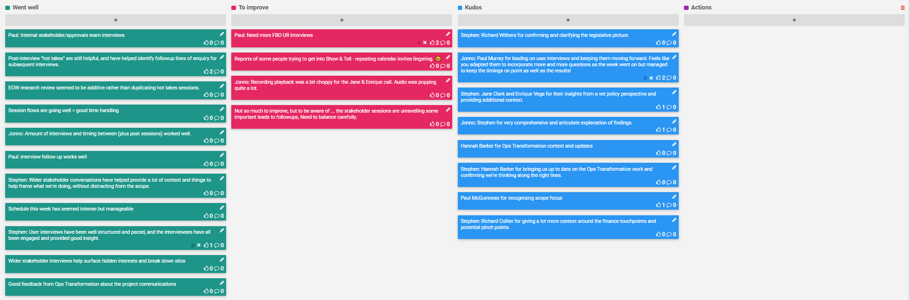
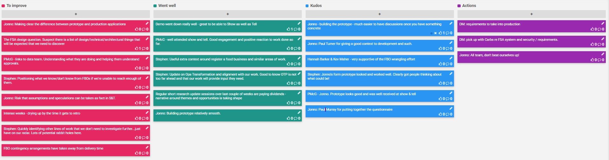
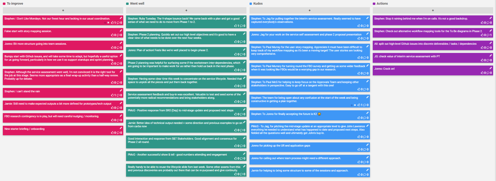
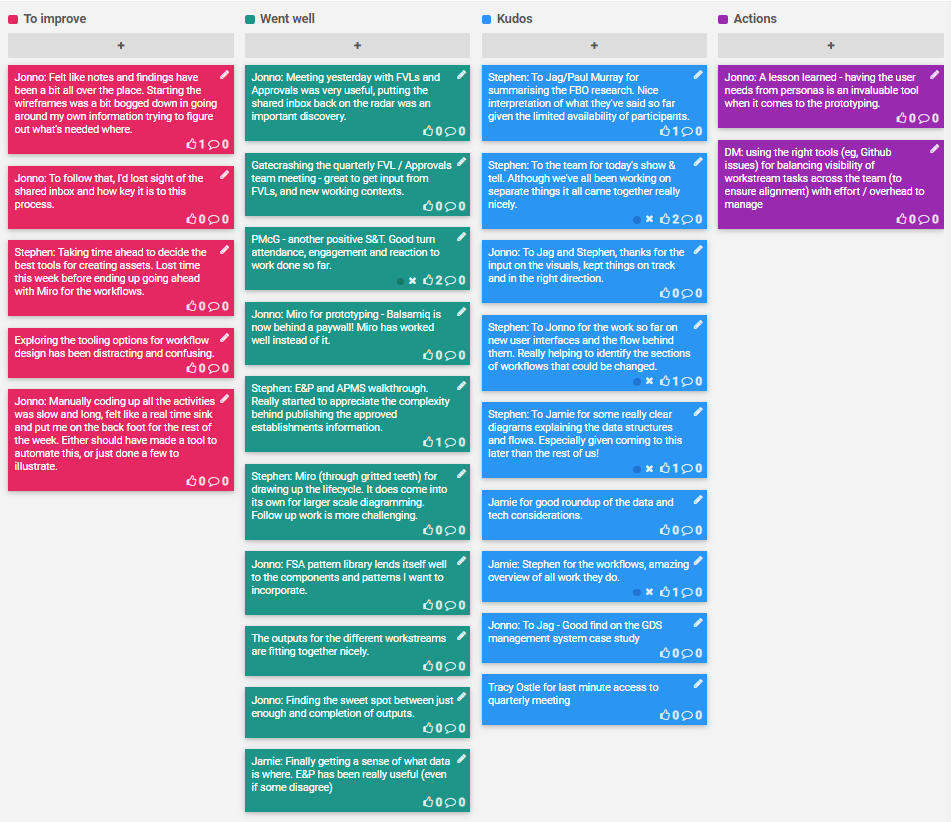
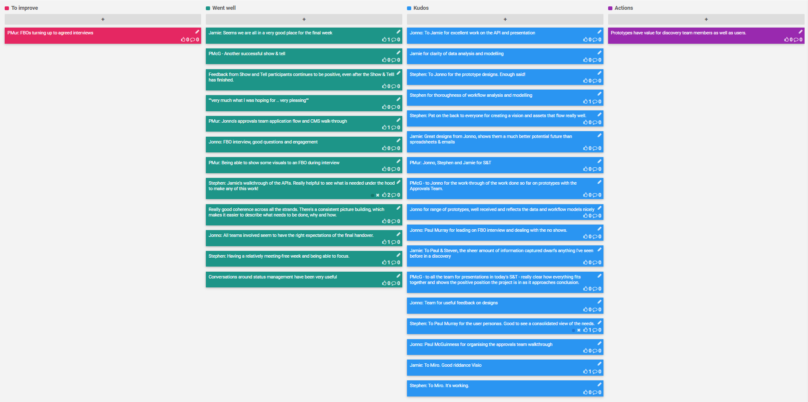
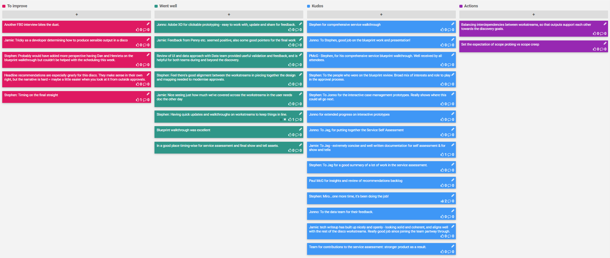
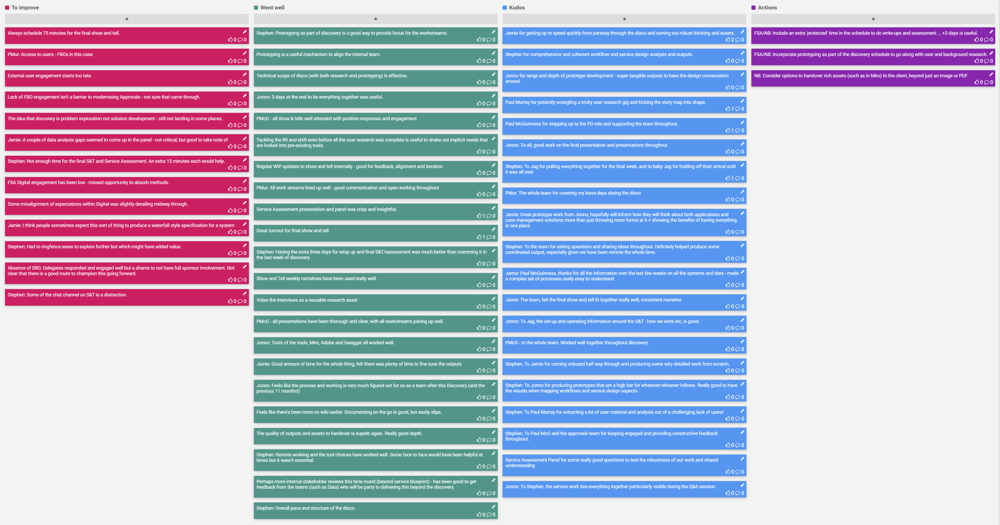

A retrospective is a ceremony held by an agile team at the end of each sprint to openly discuss what is going well and what needs improvement. It's a key activity to help the team iteratively improve their working culture.

[TOC]

## [Sprint 1 (10-19 Jun)](Sprint-1-Retrospective)

## [Sprint 2 (22-26 Jun)](Sprint-2-Retrospective)

## [Sprint 3 (29 Jun - 3 Jul)](Sprint-3-Retrospective)

## [Sprint 4 (6-10 Jul)](Sprint-4-Retrospective)

## [Sprint 5 (13-17 Jul)](Sprint-5-Retrospective)

## [Sprint 6 (20-24 Jul)](Sprint-6-Retrospective)

## [Sprint 7 (27-31 Jul)](Sprint-7-Retrospective)

## [Sprint 8 (3-7 Aug)](Sprint-8-Retrospective)

## [Full Discovery Retrospective](Discovery-Retrospective)
