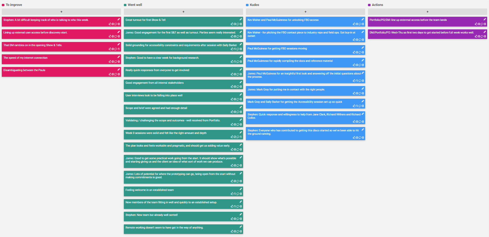

## 10-19 June 2020

## Kudos

- Kev Maher and Paul McGuinness for unlocking FBO access
- Kev Maher - for pitching the FBO contact piece to industry reps and field ops.  Got buy-in at outset
- Paul McGuiness for getting FBO sessions moving
- Paul McGuinness for rapidly compiling the docs and reference material
- Paul McGuiness for an insightful first look and answering off the initial questions about the process.
- Mark Gray for putting me in contact with the right people.
- Mark Gray and Sally Barker for getting the Accessibility session set up so quick
- Quick response and willingness to help from Jane Clark, Richard Withers and Richard Collier.
- Everyone who has contributed to getting this disco started so we've been able to hit the ground running.

## Went well

- Great turnout for first Show & Tell
- Good engagement for the first S&T as well as turnout. Parties seem really interested.
- Solid grounding for accessibility constraints and requirements after session with Sally Barker
- Good to have a clear week for background research.
- Really quick responses from everyone to get involved
- Good engagement from all internal stakeholders
- User interviews look to be falling into place well
- Scope and brief were agreed and had enough detail
- Validating / challenging the scope and outcomes - well received from Portfolio.
- Week 0 sessions were solid and felt like the right amount and depth
- The plan looks and feels workable and pragmatic, and should get us adding value early.
- Good to get some practical work going from the start. It should show what's possible and starting giving us and the client an idea of what sort of work we can produce.
- Lots of potential for where the prototyping can go, being open from the start without making commitments is good.
- Feeling welcome in an established team
- New members of the team fitting in well and quickly to an established setup.
- New team but already well sorted!
- Remote working doesn't seem to have got in the way of anything.

## To improve

- Stephen: A bit difficult keeping track of who is talking to who this week.
- Lining up external user access before discovery start.
- That DM rambles on in the opening Show & Tells.
- The speed of my internet connection
- Disambiguating between the Pauls

## Action items

- Portfolio/PO/DM: line up external access before the team lands

- DM/Portfolio/PO: Wed+Thu as first two days to get started before full week works well.